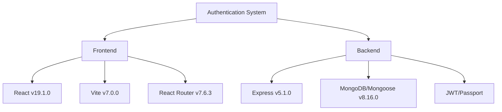
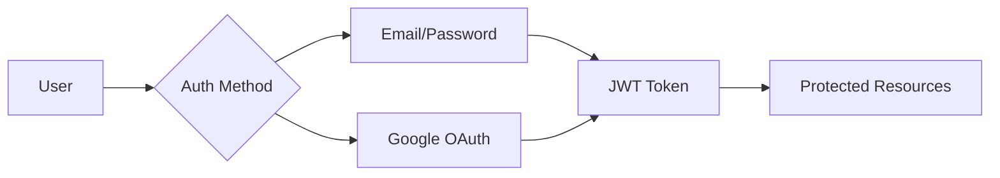
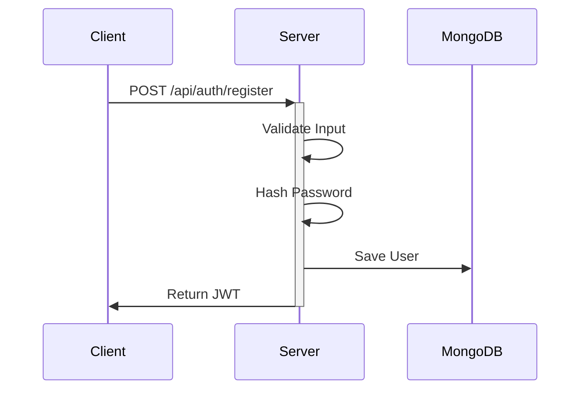
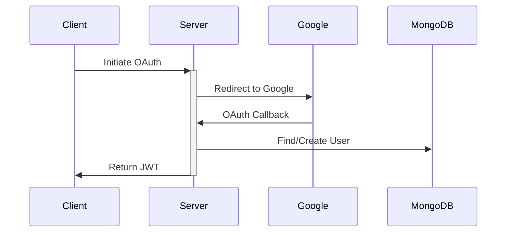

# Serena Project Analysis Report
Generated on: 6/30/2025, 9:12:42 PM (UTC+8:00)

## 1. Architecture Overview

### 1.1 Technology Stack

### 1.2 System Components
- **Frontend Layer**: Modern React application with Vite
- **Backend Layer**: Express.js REST API
- **Data Layer**: MongoDB with Mongoose ORM
- **Authentication**: Hybrid JWT + OAuth (Google) system

## 2. Security Analysis

### 2.1 Authentication Methods

### 2.2 Security Features
✅ Implemented:
- JWT-based authentication with 1-day expiration
- Password hashing using bcrypt
- Email normalization and validation
- Google OAuth integration
- Secure password requirements (8+ characters)
- Token-based authorization middleware
- Protected route middleware

⚠️ Potential Enhancements:
- Refresh token implementation
- Rate limiting for auth endpoints
- Password complexity requirements
- CSRF protection
- HTTP-only cookies for token storage

## 3. Code Quality Assessment

### 3.1 Frontend Architecture
**Strengths:**
- Clean context-based state management
- Proper separation of concerns (services/context/components)
- Efficient token persistence handling
- Type checking with React types

**Areas for Improvement:**
- Add error boundary implementation
- Implement loading states handling
- Add client-side input validation
- Consider implementing token refresh mechanism

### 3.2 Backend Architecture
**Strengths:**
- Modular code organization
- Comprehensive error handling
- Secure password hashing
- Efficient MongoDB schema design
- Clean middleware implementation

**Areas for Improvement:**
- Add request validation middleware
- Implement API rate limiting
- Add request logging
- Consider caching layer for user data

## 4. Authentication Flow Analysis

### 4.1 Local Authentication

### 4.2 Google OAuth Flow

## 5. Performance Considerations
- MongoDB queries are optimized with proper indexing
- Frontend bundle optimization with Vite
- Efficient token verification process
- Proper error handling to prevent crashes

## 6. Recommendations

### 6.1 Security Enhancements
1. Implement refresh token mechanism
2. Add rate limiting for auth endpoints
3. Enhance password requirements
4. Add CSRF protection
5. Consider HTTP-only cookies

### 6.2 Code Improvements
1. Add comprehensive error handling
2. Implement request validation middleware
3. Add API documentation
4. Enhance logging system
5. Add unit and integration tests

### 6.3 DevOps Considerations
1. Set up CI/CD pipeline
2. Implement automated testing
3. Add monitoring and logging
4. Configure proper environment management
5. Set up backup strategy

## 7. Conclusion
The project implements a robust authentication system with both local and OAuth capabilities. While the core security features are well-implemented, there are opportunities for enhancement in areas such as token refresh, rate limiting, and additional security measures. The codebase is well-structured and maintainable, with clear separation of concerns and proper error handling.

---
*Report generated by Serena - Project Analysis Tool*